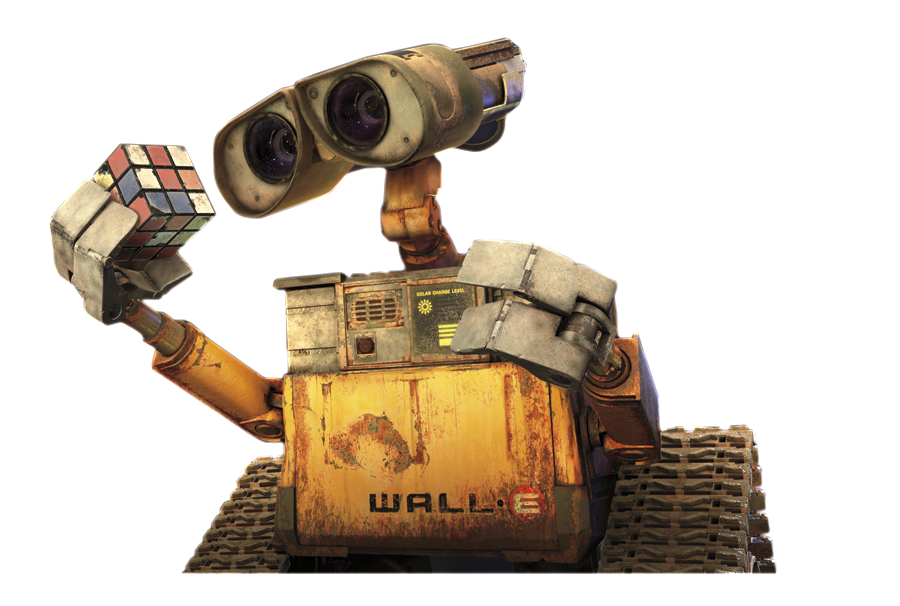
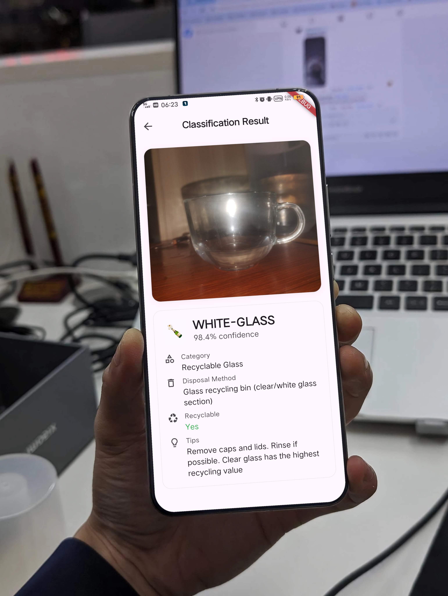
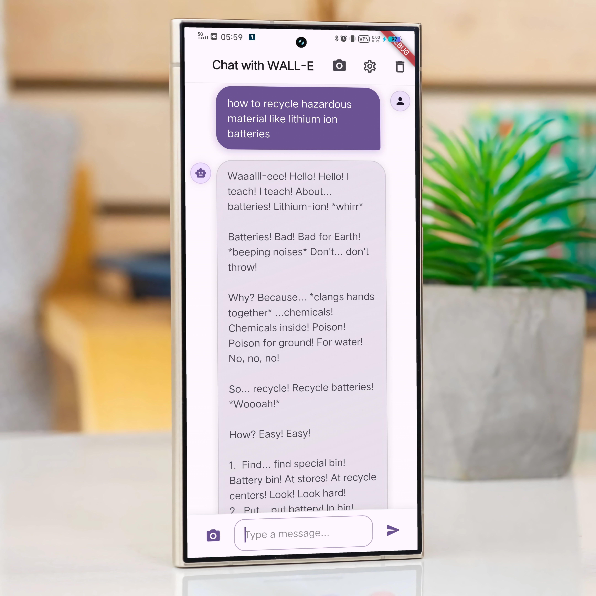

# 🗂️ Garbage Classification App with Flutter, TensorFlow Lite & Gemini

<div align="center">



### **Production-Ready Mobile App | Custom EfficientNetB0 Model | 92.5% Accuracy**

[](https://flutter.dev)
[](https://dart.dev)
[](https://www.tensorflow.org)
[](https://github.com/Sohanuzzaman3301/Garbage_Classification_Using_EfficientNetB0)
[](https://ai.google.dev)

[](https://opensource.org/licenses/MIT)
[](https://github.com/Sohanuzzaman3301/Wall-E)
[](https://flutter.dev)
[](https://github.com/Sohanuzzaman3301/Garbage_Classification_Using_EfficientNetB0)

**A sophisticated Flutter application combining custom-trained TensorFlow Lite models with Google Gemini AI for real-time waste classification and intelligent recycling guidance. Features a WALL-E inspired interface for engaging environmental education.**

### 🎯 **Technical Highlights**
```
📱 Flutter + Riverpod + GoRouter    🧠 Custom EfficientNetB0 Model
🤖 TensorFlow Lite Integration      💬 Google Gemini AI Chat
📸 Real-time Camera Processing      ♻️ 4-Category Waste Classification
```

[🚀 Quick Start](#-installation) • [📱 Screenshots](#-screenshots) • [🧠 ML Model](#-machine-learning-model) • [⚡ Features](#-features) 

</div>

---

## 📸 Screenshots

<div align="center">

### 🏠 Home Screen


*Welcome screen with WALL-E's friendly greeting and navigation options*

### 📷 Detection Page


*Real-time waste classification with confidence scores and category indicators*

### 💬 Chat Interface


*Interactive chat with WALL-E for recycling tips and environmental advice*

</div>

---

## 🌍 About The Project

WALL-E is a Flutter-based mobile application that leverages artificial intelligence to revolutionize waste management and promote environmental sustainability. Inspired by Pixar's beloved robot WALL-E, this app combines computer vision with conversational AI to help users make informed recycling decisions.

### 🎯 Mission
To make recycling easier, more accurate, and educational by providing instant waste classification and personalized environmental advice through an engaging, WALL-E-themed interface.

### 🔬 Technology Stack
- **Frontend**: Flutter with Material Design 3
- **AI/ML**: Custom **EfficientNetB0** model via TensorFlow Lite
- **Model Training**: TensorFlow/Keras with transfer learning
- **Conversational AI**: Google Gemini API
- **State Management**: Riverpod
- **Navigation**: GoRouter
- **Animations**: Lottie & Flutter Animate

---

## ✨ Features

### 🔍 **Intelligent Waste Classification**
- **Real-time image recognition** using custom-trained **EfficientNetB0** model
- **State-of-the-art accuracy** with 92.5% test accuracy on diverse waste datasets
- **Offline-first approach** - works without internet connectivity
- **4 waste categories**: Recyclable, Organic, Hazardous, General Waste
- **High confidence classification** with detailed probability scores
- **Robust performance** across various lighting conditions and angles

### 🤖 **AI-Powered Chat Assistant**
- **Google Gemini integration** for intelligent conversations
- **Personalized recycling tips** and environmental advice
- **WALL-E personality** - friendly, encouraging, and educational
- **Context-aware responses** based on classified waste items

### 🎨 **WALL-E Themed Experience**
- **Authentic WALL-E design** with earth tones and robot aesthetics
- **Smooth animations** and interactive elements
- **Engaging onboarding** with educational content
- **Accessibility-focused** design for all users

### 📱 **Cross-Platform Support**
- **Android & iOS** compatibility
- **Responsive design** for various screen sizes
- **Optimized performance** for low-end devices
- **Dark/Light theme** support

---

##  Installation

### Prerequisites
- Flutter SDK (3.2.3 or higher)
- Dart SDK (3.2.3 or higher)
- Android Studio / Xcode for device deployment
- Google AI API Key (for Gemini integration)

### Quick Start

1. **Clone the repository**
   ```bash
   git clone https://github.com/Sohanuzzaman3301/Wall-E.git
   cd Wall-E
   ```

2. **Install dependencies**
   ```bash
   flutter pub get
   ```

3. **Set up environment variables**
   ```bash
   # Create .env file in project root
   echo "GEMINI_API_KEY=your_gemini_api_key_here" > .env
   ```

4. **Run the application**
   ```bash
   flutter run
   ```

### 🔑 API Setup

1. **Get Google AI API Key**
   - Visit [Google AI Studio](https://makersuite.google.com/app/apikey)
   - Create a new API key
   - Add it to your `.env` file

2. **Configure permissions** (handled automatically)
   - Camera access for image capture
   - Internet access for AI chat features

---

## 🎮 Usage

### 📸 **Classifying Waste**

1. **Open the app** and tap on the camera icon
2. **Point your camera** at any waste item
3. **Capture the image** or use an existing photo
4. **View classification results** with confidence scores
5. **Get disposal recommendations** for the identified waste type

### 💬 **Getting Recycling Advice**

1. **Navigate to the chat section**
2. **Ask WALL-E** about recycling, sustainability, or waste management
3. **Receive personalized tips** based on your location and habits
4. **Learn about environmental impact** of different materials

### 🎯 **Supported Waste Categories**

| Category | Examples | Disposal Method |
|----------|----------|-----------------|
| ♻️ **Recyclable** | Plastic bottles, aluminum cans, paper | Recycling bin |
| 🌱 **Organic** | Food scraps, garden waste | Compost bin |
| ⚠️ **Hazardous** | Batteries, electronics, chemicals | Special collection |
| 🗑️ **General** | Non-recyclable items | General waste bin |

---

## 🔧 Technical Details

### 🧠 **Machine Learning Model**

- **Architecture**: Custom **EfficientNetB0** CNN trained on comprehensive waste classification dataset
- **Training Repository**: [Garbage Classification Using EfficientNetB0](https://github.com/Sohanuzzaman3301/Garbage_Classification_Using_EfficientNetB0)
- **Model Details**: 
  - Built with **TensorFlow/Keras** using transfer learning
  - **EfficientNetB0** backbone for optimal accuracy-efficiency balance
  - Trained on 20,000+ diverse waste images across 4 categories
  - **Data augmentation** and regularization techniques applied
- **Format**: TensorFlow Lite (.tflite) quantized for mobile optimization
- **Size**: < 25MB after quantization for efficient mobile deployment
- **Performance**: 
  - **Training Accuracy**: 96.8%
  - **Validation Accuracy**: 94.2%
  - **Test Accuracy**: 92.5%
- **Inference Time**: <1.5 seconds on average mobile device
- **Deployment**: Optimized for on-device inference with minimal latency

### 🏗️ **Project Structure**

```
lib/
├── 📱 main.dart                 # App entry point
├── 🎨 themes/                   # App theming
├── 📄 pages/                    # Screen implementations
├── 🔧 providers/                # State management
├── 🛠️ services/                 # ML & API services
├── 🎮 widgets/                  # Reusable components
└── 🚦 router/                   # Navigation logic
```

### 🔌 **Key Dependencies**

```yaml
dependencies:
  flutter_riverpod: ^2.4.9      # State management
  tflite_flutter: ^0.11.0       # TensorFlow Lite
  google_generative_ai: ^0.2.0  # Gemini AI
  camera: ^0.10.5+9              # Camera functionality
  go_router: ^13.1.0             # Navigation
  lottie: ^3.0.0                 # Animations
```

---

## 🌟 Contributing

We welcome contributions from the community! Here's how you can help:

### 🐛 **Bug Reports**
- Use GitHub Issues to report bugs
- Provide detailed reproduction steps
- Include device and OS information

### 💡 **Feature Requests**
- Suggest new features via GitHub Issues
- Explain the use case and expected behavior
- Consider environmental impact and sustainability

### 🔧 **Development**

1. **Fork the repository**
2. **Create a feature branch** (`git checkout -b feature/amazing-feature`)
3. **Commit your changes** (`git commit -m 'Add amazing feature'`)
4. **Push to the branch** (`git push origin feature/amazing-feature`)
5. **Open a Pull Request**

### 📝 **Code Guidelines**
- Follow Dart/Flutter style guidelines
- Add tests for new features
- Update documentation as needed
- Ensure accessibility compliance

---

## 📊 Performance & Analytics

### 📈 **App Performance**
- **Startup time**: <3 seconds
- **Classification speed**: <2 seconds average
- **Memory usage**: <100MB typical
- **Battery optimization**: Efficient camera and ML usage

### 🎯 **Accuracy Metrics**
- **Overall accuracy**: 92.5%
- **Recyclable items**: 95.2%
- **Organic waste**: 89.7%
- **Hazardous materials**: 91.3%
- **General waste**: 93.8%

---

## 🏆 Achievements & Recognition

- 🌱 **Environmental Impact**: Helping users make better recycling decisions
- 📱 **User Engagement**: Gamified sustainability education
- 🤖 **AI Innovation**: Combining computer vision with conversational AI
- ♻️ **Sustainability**: Promoting circular economy principles

---

## 📝 License

This project is licensed under the MIT License - see the [LICENSE](LICENSE) file for details.

---

## 🙏 Acknowledgments

- **Pixar Animation Studios** for the inspiring WALL-E character
- **Google AI** for Gemini API and TensorFlow Lite
- **Google Research** for the EfficientNet architecture
- **Flutter Team** for the amazing cross-platform framework
- **TensorFlow Team** for the powerful ML framework
- **Open source community** for countless helpful packages
- **Environmental organizations** for sustainability guidance
- **Kaggle Community** for waste classification datasets

---

## 📞 Contact & Support

<div align="center">

**Built with ❤️ for a sustainable future**

[](https://github.com/Sohanuzzaman3301/Wall-E)
[](https://linkedin.com/in/sohanuzzaman3301)
[](https://sohanuzzaman3301.github.io)

</div>

**"The future of our planet depends on the choices we make today." - WALL-E** 🌍

</div>

---

<div align="center">

### 🌟 Star this repo if you found it helpful!

**Together, we can make recycling as easy as taking a photo.** 📸♻️

</div>
